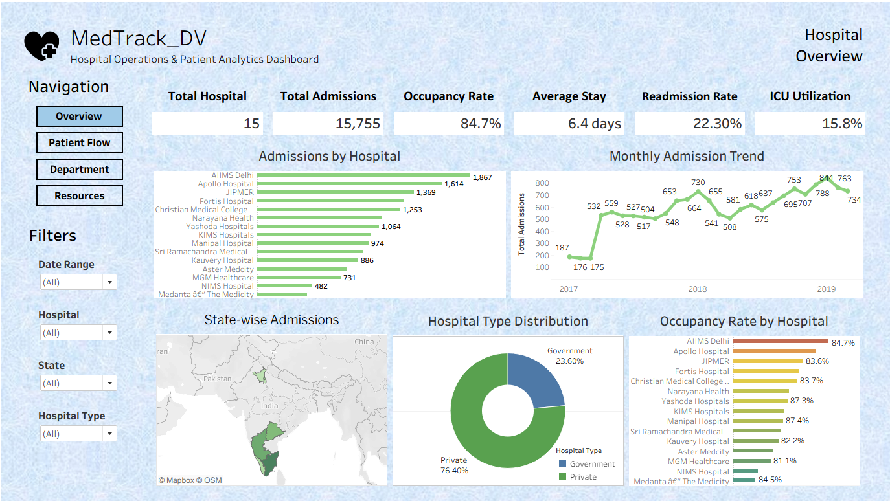
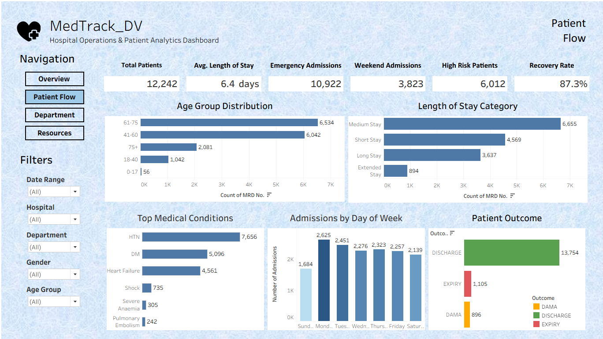
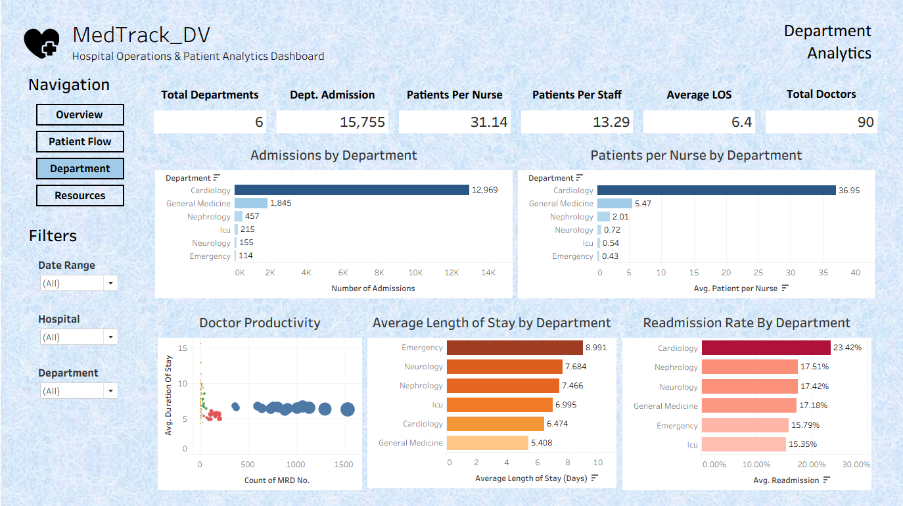
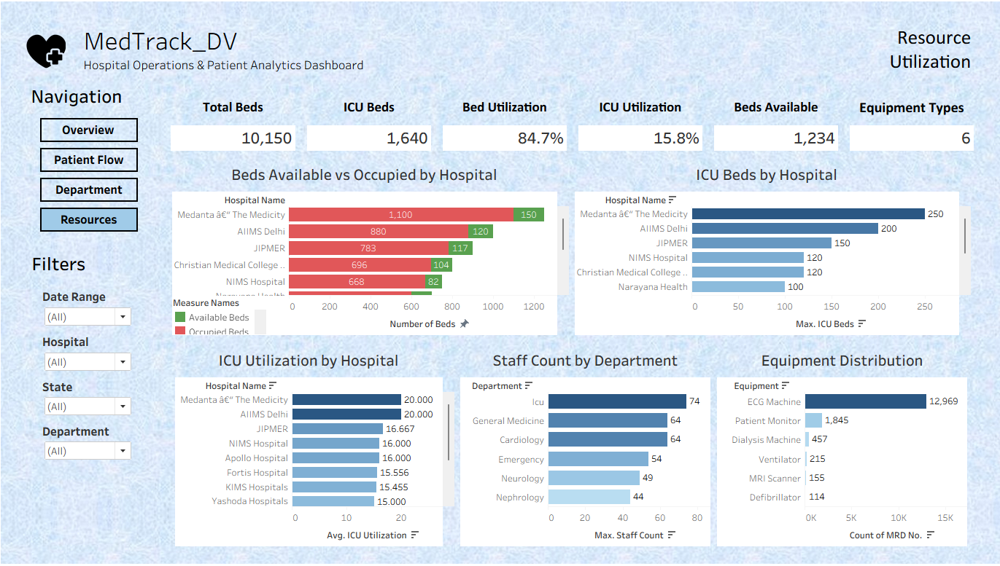

# 🏥 MedTrack_DV - Hospital Operations & Patient Analytics Dashboard

A comprehensive Hospital Operations & Patient Analytics Dashboard built using **Tableau**, **Python**, and **Excel** to analyze hospital performance, patient flow, departmental efficiency, and resource utilization.

---

## 📌 Project Overview

MedTrack_DV is an interactive analytics dashboard designed to help hospital administrators monitor key operational metrics, optimize resource allocation, and gain actionable insights from healthcare data.

The project transforms raw hospital datasets into meaningful visualizations through data cleaning, KPI engineering, and interactive Tableau dashboards.

---

## 🎯 Problem Statement

Hospitals generate large amounts of operational data every day. Without effective analysis, it becomes difficult to monitor patient admissions, resource utilization, departmental performance, and overall hospital efficiency.

This project provides an interactive dashboard solution that enables decision-makers to:

- Monitor hospital performance
- Analyze patient flow
- Evaluate department efficiency
- Track resource utilization
- Support data-driven decision making

---

# 🎯 Objectives

- Analyze hospital admissions
- Monitor occupancy and ICU utilization
- Track patient outcomes
- Evaluate departmental performance
- Analyze resource utilization
- Build interactive dashboards for hospital management

---

# 📊 Dashboard Modules

## 1️⃣ Hospital Overview

Provides an overall summary of hospital performance.

### KPIs

- Total Hospitals
- Total Admissions
- Occupancy Rate
- Average Length of Stay
- Readmission Rate
- ICU Utilization

### Visualizations

- Admissions by Hospital
- Monthly Admission Trend
- State-wise Admissions
- Hospital Type Distribution
- Occupancy Rate by Hospital

---

## 2️⃣ Patient Flow

Analyzes patient movement and treatment outcomes.

### KPIs

- Total Patients
- Average Length of Stay
- Emergency Admissions
- Weekend Admissions
- High Risk Patients
- Recovery Rate

### Visualizations

- Age Group Distribution
- Length of Stay Category
- Top Medical Conditions
- Admissions by Day of Week
- Patient Outcome

---

## 3️⃣ Department Analytics

Evaluates departmental performance and efficiency.

### KPIs

- Total Departments
- Department Admissions
- Patients per Nurse
- Patients per Staff
- Average Length of Stay
- Total Doctors

### Visualizations

- Admissions by Department
- Patients per Nurse by Department
- Doctor Productivity
- Average Length of Stay by Department
- Readmission Rate by Department

---

## 4️⃣ Resource Utilization

Monitors hospital resources and infrastructure.

### KPIs

- Total Beds
- ICU Beds
- Bed Utilization
- ICU Utilization
- Beds Available
- Equipment Types

### Visualizations

- Beds Available vs Occupied
- ICU Beds by Hospital
- ICU Utilization by Hospital
- Staff Count by Department
- Equipment Distribution

---

# 🛠 Technologies Used

- Tableau Desktop
- Python
- Pandas
- NumPy
- Microsoft Excel
- Jupyter Notebook

---

# 📂 Dataset Information

The project uses multiple healthcare datasets including:

- Patient Admissions
- Hospital Information
- Department Resources

The datasets were cleaned, transformed, and merged into a final analytical dataset before visualization.

---

# 📈 KPIs Created

- Total Hospitals
- Total Patients
- Total Admissions
- Total Departments
- Total Doctors
- Total Beds
- ICU Beds
- Occupancy Rate
- ICU Utilization
- Recovery Rate
- Readmission Rate
- Average Length of Stay
- Patients per Nurse
- Patients per Staff
- Bed Availability

---

# 📁 Project Structure

```
MedTrack_DV/
│
├── dashboard/
│   ├── dashboard_storyboard.pdf
│   └── MedTrack_DV.twb
│
├── data/
│   ├── hospital_cleaned.xlsx
│   ├── hospital_final_dataset.xlsx
│   └── hospital_raw_data.xlsx
│
├── notebooks/
│   ├── data_collection.ipynb
│   ├── hospital_cleaning.ipynb
│   └── generate_hospital_kpis.ipynb
│
├── raw-dataset/
│   ├── department_resources.xlsx
│   ├── hospital_info.xlsx
│   └── patient_admissions.xlsx
│
├── screenshots/
│   ├── dashboard1.png
│   ├── dashboard2.png
│   ├── dashboard3.png
│   └── dashboard4.png
│
└── README.md
```

---

# 📷 Dashboard Screenshots

## Hospital Overview



---

## Patient Flow



---

## Department Analytics



---

## Resource Utilization



---

# 🔍 Key Insights

- Cardiology recorded the highest number of patient admissions.
- Occupancy rate remained above 80% across most hospitals.
- Readmission rates varied across departments.
- ICU utilization highlighted differences in critical care demand.
- Patient workload differed significantly between departments.
- Resource availability varied across hospitals.

---

# 🚀 Future Enhancements

- Real-time data integration
- Predictive analytics using Machine Learning
- Patient readmission prediction
- Doctor performance forecasting
- Bed demand forecasting
- Automated reporting

---

# ▶️ How to Open the Project

1. Install Tableau Desktop.
2. Open the `MedTrack_DV.twb` workbook.
3. Navigate through the four dashboards using the built-in navigation buttons.
4. Use the interactive filters to explore the data.

---

# 👨‍💻 Author

**Hariharan A**

B.Tech Computer Science Engineering (AI & Data Science)

Data Analytics | Tableau | Python | SQL | Excel

---

# ⭐ If you found this project useful, consider giving it a star!
